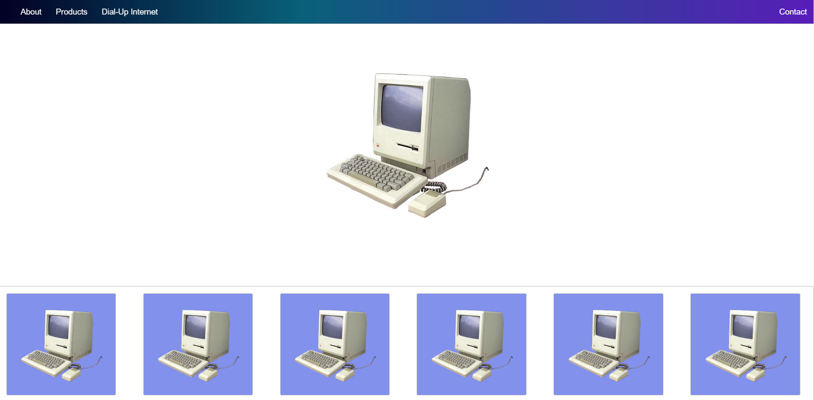

# Bonus Grid Layout Exercise

- Try to create a website layout like the reference image below.

- Create the Nav using CSS Grid or Flexbox.

- Have a banner/hero section below that.

- Use CSS grid to create a section like the one at the bottom.

- Add a footer below it.

**The focus here is mainly on using CSS grid in part of a site layout. Feel free to use whatever images and colors you want, it doesn't have to be exactly like the reference image.**

